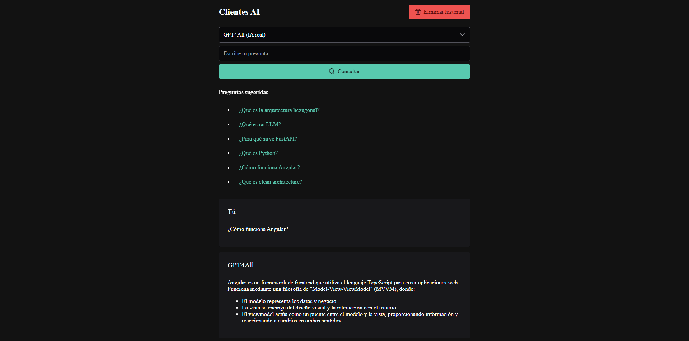

# 🧠 Consulta App

Aplicación web para simular consultas con inteligencia artificial, con opción de usar un modelo real (GPT4All) o clientes simulados, mostrando respuestas extraídas desde documentos relacionados.

## 📁 Estructura del proyecto

```bash
consultas-app/
├── backend/
│ ├── adapters/
│ ├── core/
│ ├── main.py
│ └── ...
├── frontend/
│ ├── src/
│ ├── angular.json
│ ├── package.json
│ └── ...
├── README.md
└── requirements.txt
```


---

### 🛠️ Tecnologías y herramientas utilizadas

### Frontend
- Angular 19: Framework SPA robusto para desarrollo frontend.
- PrimeNG: Librería de componentes UI con integración fluida en Angular.
- TypeScript: Tipado fuerte para escalabilidad y mantenibilidad.
- Vite: Servidor de desarrollo rápido (Angular lo usa internamente desde v17).

### Backend
- Python 3.10+
- FastAPI: Framework rápido y moderno para construir APIs con Python.
- Uvicorn: Servidor ASGI para ejecutar FastAPI.
- httpx: Cliente HTTP asíncrono para Python.

### IA
- GPT4All (Meta Llama 3): Modelo de lenguaje ejecutado localmente como API.

### Otras herramientas
- LocalStorage: Para persistir historial de preguntas por cliente.
- Marked.js: Para renderizar respuestas en formato Markdown en el frontend.
- Arquitectura hexagonal: Aplicada en el backend para separar responsabilidades.


## 🚀 Funcionalidades

- Simulación de múltiples clientes con respuestas desde documentos `.txt`.
- Integración con GPT4All (modelo Llama 3 8B) vía API local.
- Interfaz moderna en Angular con PrimeNG.
- Carga y visualización de historial por cliente.
- Confirmación para eliminar historial.
- Soporte para preguntas sugeridas.
- Spinner de carga con espera simulada para clientes ficticios.
- Frontend responsive y estructurado.

---

## ⚙️ Requisitos

### Backend (Python 3.10+)
- FastAPI
- httpx
- Uvicorn
- `GPT4All` corriendo localmente (`http://localhost:4891/v1/chat/completions`)

### Clonar el repositorio

```bash
git clone https://github.com/luisrapalino/consultas-app.git
cd consultas-app
```

### Instalación de dependencias:

```bash
cd backend
python -m venv venv
venv\Scripts\activate  # en Windows
pip install -r requirements.txt
```

### Iniciar servidor:

```bash
uvicorn main:app --reload
```
El backend quedará disponible en: http://localhost:8000

### Frontend (Angular 17+, PrimeNG, Vite)

```bash
npm install -g @angular/cli
cd frontend
npm install
ng serve
```
El frontend quedará disponible en: http://localhost:4200 o según indique Vite

### 💡 Notas importantes
- Los documentos de cada cliente se encuentran en una carpeta específica y se consultan automáticamente por el backend.
- El historial se guarda localmente por cliente en localStorage.
- El modelo GPT4All debe estar corriendo antes de consultar con el cliente GPT4All.

### 🧠 Decisiones técnicas
- Angular + PrimeNG: Framework moderno con soporte de componentes, animaciones y UX amigable.
- FastAPI: Por su rapidez, tipado fuerte y estructura clara para APIs REST.
- Arquitectura hexagonal: Para lograr desacoplamiento entre la lógica de negocio, API y documentos.
- Cliente IA real opcional: Se integró GPT4All como LLM local, configurable.

### 🧾 Cómo agregar un nuevo cliente
1. Crea una carpeta con el nombre del cliente en:
```bash
backend/clientes/<nombre_cliente>
```
2. Agrega archivos .txt con contenido relevante, por ejemplo:
```bash
contacto.txt
servicios.txt
ubicacion.txt
```
3. (Opcional) Agrega preguntas sugeridas en el frontend (faqPorCliente en consulta.component.ts)

## 🖼️ Vista previa


